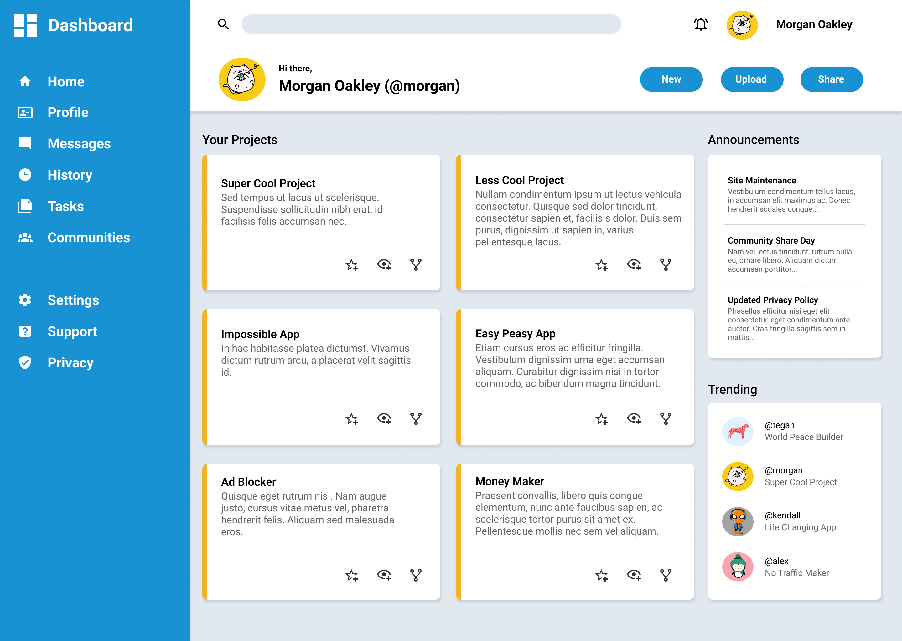

# Admin Dashboard Replica

🚀 Welcome to the Admin Dashboard Replica project! This project aims to replicate the design and layout of a typical admin dashboard interface.

## Overview
This project is a static HTML and CSS replica of an admin dashboard. It serves as a demonstration of UI/UX design skills and layout implementation.

## Features
- Sidebar Navigation: Mimics the navigation panel commonly found in admin dashboards.
- Profile Section: Displays user profile information and provides options for profile management.
- Project Section: Lists various projects with basic details.
- Announcements and Trending Section: Displays announcements and trending topics in separate panels.

## Technologies Used
- HTML: Used for creating the structure and content of the web pages.
- CSS: Used for styling the elements and implementing the layout design.

- FontAwesome: Integrated for the inclusion of icons.
- Material Design Icons: Added for additional icon options.
- Roboto Font: Utilized for its modern and clean typography.

## Live
[Click here](https://blondymartinez.github.io/AdminDashboard/)

## Reference

## Screenshot

